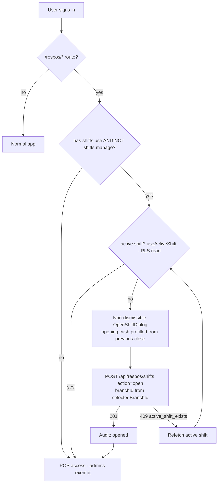
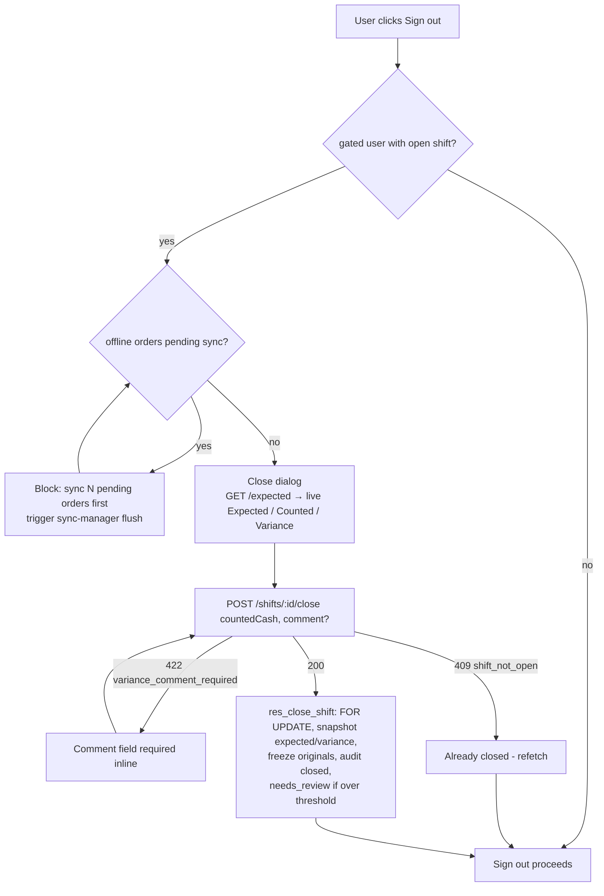
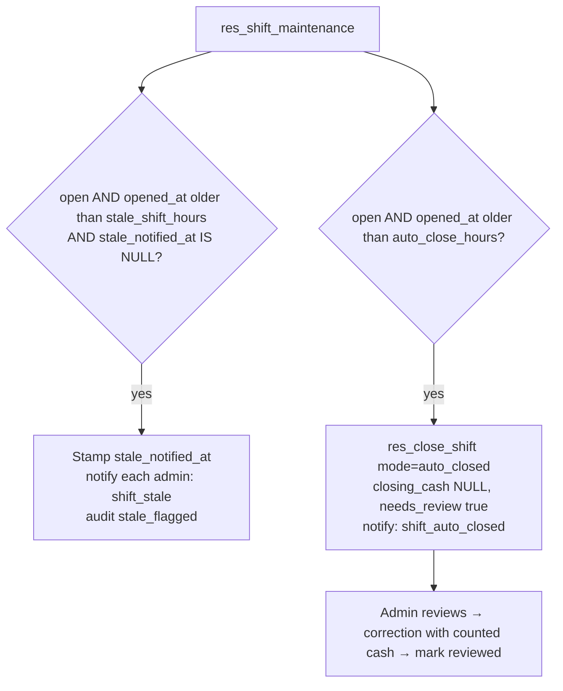

# Implementation Plan: Shift Management Enhancement

**Branch**: `026-shift-management-enhancement` · **Date**: 2026-07-11
**Spec**: [spec.md](./spec.md) · **Data model**: [data-model.md](./data-model.md) · **Contracts**: [contracts/api-contracts.md](./contracts/api-contracts.md)

## Summary

Enhance the existing respos shift system (`res_shifts`, `/respos/shifts`,
enforcement gate) into a full shift-management module: branch-tagged shifts,
server-computed expected cash + persisted variance, cash movements, admin
oversight (search, force-close, corrections, review), immutable audit trail,
live "who's working" view, analytics, and stale-shift flag/auto-close — all
with an additive migration and zero disruption to the working open/close flow
mid-rollout.

## Technical Context

- **Language/stack**: TypeScript, React 19 + Vite, TanStack Router/Query,
  Zustand, Zod, Prisma 7 (+pg adapter), Supabase (Auth, RLS, Realtime, pg_cron),
  Recharts, react-i18next, vitest.
- **Server pattern**: TanStack Start API routes `src/routes/api/**` →
  `requireAuth(token, perm)` → `src/server/fns/*` → Prisma. (Note: CLAUDE.md
  mentions `src/app/api/**`; the actual live pattern is `src/routes/api/**`.)
- **Money**: Postgres `DECIMAL(12,2)` end-to-end; decimal strings over the wire;
  no JS float math.
- **Constraints**: additive-only migration; legacy direct-supabase open/close
  must keep working until Phase 2 lands; existing tests
  (`shift-enforcement.test.ts`, `shifts.open-shift-dialog.test.tsx`) stay green
  or are updated with the phase that changes behavior.

## Flow diagrams

### Open shift (login → POS access)

### Close shift (logout path)

### Abandoned shift (server-side, pg_cron every 15 min + lazy fallback)

## RBAC

Add to `BASE_PERMISSION_DEFINITIONS` + `DEFAULT_ROLE_PERMISSION_NAMES` in
`src/features/users/data/rbac.ts` (lazily seeded — no migration):
`shifts.use`, `shifts.view`, `shifts.manage` (grants per spec.md). Migrate all
role-name checks (shifts page, sidebar item, enforcement gate, sign-out dialog)
to permission checks.

## Phases

### Phase 1 — Migration + schema + RBAC (no behavior change)
- **New**: `prisma/migrations/20260711120000_shift_management_enhancement/migration.sql` (full SQL in data-model.md).
- **Modified**: `prisma/schema.prisma` (res_shifts columns/relations + 3 new models); `src/features/users/data/rbac.ts` (3 permissions + default grants).
- Run `pnpm exec prisma generate`.
- **Tests**: grant-matrix assertion; existing shift tests still pass (RLS still permits own-open updates, so legacy flow unaffected).

### Phase 2 — Server API + client data layer
- **New**:
  - `src/features/respos/data/shift-schemas.ts` — Zod schemas + money-string helpers (shared client/server).
  - `src/features/respos/data/shift-actions.ts` — `authorizedRequest`-style client actions.
  - `src/server/fns/shifts.ts` — open/close/force-close/correct/movements/review/settings/list/audit + ownership helper (own-vs-any per contracts).
  - `src/server/fns/shift-analytics.ts` — deferred to Phase 5 (listed here for orientation).
  - Routes: `src/routes/api/respos/shifts.ts`, `shifts.$shiftId.close.ts`, `shifts.$shiftId.force-close.ts`, `shifts.$shiftId.corrections.ts`, `shifts.$shiftId.movements.ts`, `shifts.$shiftId.expected.ts`, `shifts.$shiftId.audit.ts`, `shifts.$shiftId.review.ts`, `shifts.active.ts`, `shifts.settings.ts`.
- **Modified**:
  - `src/features/respos/api/mutations.ts` — `useOpenShift`/`useCloseShift` re-pointed to the API actions; add `useAddCashMovement`, `useForceCloseShift`, `useCorrectShift`, `useReviewShift`.
  - `src/features/respos/api/queries.ts` — new query keys: `activeShiftsAll`, `shiftAudit`, `shiftExpected`, `shiftSettings`, `shiftMovements`; own-shift reads (`useActiveShift`/`useShifts`) untouched.
  - `src/features/respos/types.ts` — extend `ResShift`; add `ResCashMovement`, `ResShiftAudit`, `ResShiftSettings`.
- **Tests**: schema unit tests (money regex, enum unions); server-fn ownership matrix (own+use ✓ / other+use ✗ / other+manage ✓) with mocked Prisma; 409/422 error-mapping tests.

### Phase 3 — Enforcement deltas
- **Modified**:
  - `src/features/respos/lib/shift-enforcement.ts` — predicate from `isCashier` to `permissionNames.includes('shifts.use') && !includes('shifts.manage')`.
  - `src/features/respos/components/respos-shift-enforcement-gate.tsx` — pass `branchId` (selectedBranchId → profile.branch_id fallback); handle 409 by refetching.
  - `src/components/sign-out-dialog.tsx` — same predicate; upgraded close dialog (expected/variance preview, threshold-driven required comment, offline-pending-orders guard).
  - Extract close dialog from `src/features/respos/pages/shifts.tsx` into `src/features/respos/components/close-shift-dialog.tsx` (shared by sign-out + shifts page).
- **Tests**: update `shift-enforcement.test.ts` (permission matrix: manager gated, kitchen/admin not); update `shifts.open-shift-dialog.test.tsx`; new close-dialog tests (comment required over threshold; sign-out blocked until closed).

### Phase 4 — Admin UI
- **Modified**: `src/features/respos/pages/shifts.tsx` — Tabs shell: **My Shift** (existing UI) · **All Shifts** · **Live** · **Analytics** (tabs 2–4 permission-guarded); variance display switches to server-computed values. `src/components/layout/data/sidebar-data.ts` — shifts item roles += manager (or permission-driven). `src/assets/i18n/en.json` + `ar.json` — `shifts.*` namespace additions.
- **New** components in `src/features/respos/components/`: `shifts-admin-table.tsx` (filters, pagination, needs-review/corrected/stale badges), `shift-detail-drawer.tsx` (totals, movements, audit timeline w/ originals), `force-close-dialog.tsx`, `shift-correction-dialog.tsx` (original vs effective), `shift-settings-dialog.tsx`, `cash-movement-dialog.tsx`.
- **Tests**: force-close reason required; correction dialog preserves original display; settings validation (autoCloseHours > staleShiftHours).

### Phase 5 — Analytics
- **New**: `src/server/fns/shift-analytics.ts` (4 `$queryRaw` aggregations per contracts §11); `src/routes/api/respos/shifts.analytics.ts`; `src/features/respos/components/shift-analytics-tab.tsx` (Recharts, range Tabs, KPI cards — follow `src/features/pos/components/shift-dashboard.tsx`).
- **Tests**: param-plumbing tests with mocked `$queryRaw`; pure-function tests for client transforms (day-bucket fill, hour grid).

### Phase 6 — Realtime, notifications, who's-working, maintenance activation
- **Modified**: `src/features/respos/hooks/use-realtime.ts` — add `res_shifts` postgres_changes → invalidate shift query keys; notifications dropdown mapping for `shift_stale` / `shift_auto_closed` / `shift_high_variance` / `shift_force_closed` (i18n + deep link).
- **New**: `src/features/respos/components/whos-working-tab.tsx` — live open-shift list, client-side elapsed timers, stale badge, quick force-close.
- **Ops**: verify pg_cron enabled on the Supabase project (migration registration is guarded; lazy fallback already covers function-ality without it).
- **Tests**: realtime invalidation test (existing pattern); stale computation unit test.

## Rollout safety

Phases 1→3 ship independently. Between Phase 1 and 2 the legacy
direct-supabase open/close continues working: the RLS change only blocks
updating **closed** rows (legacy never does that), and the unique index is
pre-cleaned by the migration's duplicate-open data fix.

## Verification

1. `pnpm exec prisma migrate dev` applies cleanly; `pnpm exec prisma generate`.
2. `pnpm build` (typecheck) and `pnpm test` — existing shift tests green
   through Phase 1; updated with Phase 3.
3. Manual E2E (`pnpm dev`, port 5190): cashier login → gate forces open →
   record cash sale + paid-out movement → sign out → close dialog shows
   expected/variance → over-threshold close without comment rejected (422) →
   admin sees shift in All Shifts with needs-review badge → correction →
   audit timeline shows original + correction → Live tab reflects a second
   user's open shift in realtime.
4. Abandoned-shift check: set `stale_shift_hours=0`/`auto_close_hours=0` in
   `res_shift_settings`, run `SELECT res_shift_maintenance()` — shift flagged
   then auto-closed with notifications.

## Complexity tracking

| Risk | Mitigation |
|---|---|
| Duplicate open shifts pre-migration break the unique index | Data-fix UPDATE runs before index creation |
| RLS policy name for res_shifts UPDATE differs in prod | Inspect `pg_policies` for `res_shifts` before finalizing the DROP POLICY line |
| `res_notifications` recipient semantics | One row per admin recipient (dropdown filters by `recipient_id`) |
| pg_cron unavailable | Guarded registration + lazy `res_shift_maintenance()` call from admin list endpoint |
| Mixed tenders mis-count cash sales | Documented assumption; split tender is out of scope (no per-tender table exists) |
