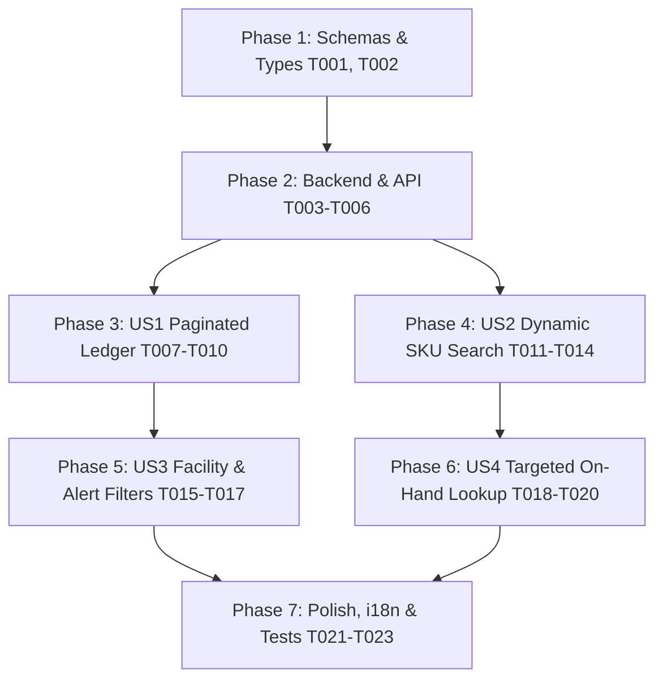

# Tasks: Stock Balance Server-Side Lazy Pagination & Dynamic SKU Search

**Input**: Design documents from `specs/026-stock-balance-paging/`  
**Prerequisites**: [plan.md](file:///e:/web-projects/web-mobile-work-apps/inventory_marketplace/react-ecommerce-restuarant/specs/026-stock-balance-paging/plan.md), [spec.md](file:///e:/web-projects/web-mobile-work-apps/inventory_marketplace/react-ecommerce-restuarant/specs/026-stock-balance-paging/spec.md), [research.md](file:///e:/web-projects/web-mobile-work-apps/inventory_marketplace/react-ecommerce-restuarant/specs/026-stock-balance-paging/research.md), [data-model.md](file:///e:/web-projects/web-mobile-work-apps/inventory_marketplace/react-ecommerce-restuarant/specs/026-stock-balance-paging/data-model.md), [contracts/](file:///e:/web-projects/web-mobile-work-apps/inventory_marketplace/react-ecommerce-restuarant/specs/026-stock-balance-paging/contracts/)

## Format: `- [ ] [TaskID] [P?] [Story?] Description with file path`

- **[P]**: Can run in parallel (different files, no dependency conflicts)
- **[Story]**: User story identifier (`[US1]`, `[US2]`, `[US3]`, `[US4]`)

---

## Phase 1: Setup & Data Contracts

**Purpose**: Update schemas, types, and contract definitions for server pagination and variant search.

- [ ] T001 [P] Update stock balance filters, pagination envelope, and metrics schemas in `src/features/stock-balances/data/schema.ts`
- [ ] T002 [P] Define variant search schemas and response types in `src/features/stock-balances/data/schema.ts`

---

## Phase 2: Foundational (Backend & API Infrastructure)

**Purpose**: Server-side pagination query execution, filter pushdown, and variant search endpoints.

- [ ] T003 Implement server-side pagination with `skip`/`take`, facility pushdown, status pushdown, and `Promise.all([findMany, count, aggregate])` in `src/server/fns/stock-balances.ts`
- [ ] T004 Update API route handler to parse pagination and filter parameters in `src/routes/api/inventory/stock-balances.ts`
- [ ] T005 [P] Create product variant search service function with tenant isolation in `src/server/fns/product-variants.ts`
- [ ] T006 Create API route handler for variant search at `src/routes/api/inventory/product-variants.ts`

---

## Phase 3: User Story 1 - Paginated Stock Balance Ledger Browsing & Lazy Loading (Priority: P1) 🎯 MVP

**Goal**: Load stock balances in lazy page slices with server pagination controls and accurate total counts.  
**Independent Test**: Load the stock balances page, verify only 20 records load initially, navigate to page 2 and page 3, change page size to 50, and confirm URL/table indicators reflect true database totals.

- [ ] T007 [US1] Update `fetchStockBalances` client action with pagination parameters and Supabase `.range()` fallback in `src/features/stock-balances/data/actions.ts`
- [ ] T008 [US1] Enhance `useStockBalances` hook with page, pageSize, total, and totalPages state in `src/features/stock-balances/hooks/use-stock-balances.ts`
- [ ] T009 [US1] Configure TanStack Table for manual server pagination, sorting, and skeleton row loading in `src/features/stock-balances/components/stock-balances-table.tsx`
- [ ] T010 [US1] Wire pagination state, page change handlers, and summary metric cards in `src/features/stock-balances/index.tsx`

---

## Phase 4: User Story 2 - Server-Side SKU Search & Lazy Loading in Stock Adjustment (Priority: P1)

**Goal**: Eliminate upfront bulk catalog fetching and provide a debounced, lazy-loaded server-side variant SKU combobox.  
**Independent Test**: Open the "New Stock Adjustment" dialog, verify it opens instantly (<100ms) without preloading products, type 3 characters in the SKU selector, and confirm matching variants display with SKU, name, barcode, and cost.

- [ ] T011 [P] [US2] Implement `searchProductVariants` client action with direct Supabase fallback in `src/features/stock-balances/data/actions.ts`
- [ ] T012 [P] [US2] Create `useVariantSearch` hook with 300ms debounce and query caching in `src/features/stock-balances/hooks/use-variant-search.ts`
- [ ] T013 [US2] Build `VariantSkuPicker` debounced combobox component with skeleton loader and keyboard navigation in `src/features/stock-balances/components/variant-sku-picker.tsx`
- [ ] T014 [US2] Replace static variant select with `VariantSkuPicker` and implement `currentRow` pre-population fast-path in `src/features/stock-balances/components/adjustment-dialog.tsx`

---

## Phase 5: User Story 3 - Facility & Stock Health Filtering with Synchronized Pagination (Priority: P2)

**Goal**: Filter stock balances by facility tabs and status alerts with server-side pushdown and automatic page reset.  
**Independent Test**: Click the "Warehouses", "Stores", or "Alerts" tabs, verify the server returns only matching records for that category, resets to page 1, and displays accurate counts.

- [ ] T015 [US3] Connect facility tabs ("All", "Alerts", "Warehouses", "Stores") to server query parameters in `src/features/stock-balances/index.tsx`
- [ ] T016 [US3] Implement automatic pagination reset to page 1 upon search query or filter change in `src/features/stock-balances/index.tsx`
- [ ] T017 [US3] Integrate server-side search input and condition faceted filter with debounce in `src/features/stock-balances/components/stock-balances-table.tsx`

---

## Phase 6: User Story 4 - Live Facility Balance & Cost Inspection in Adjustment (Priority: P2)

**Goal**: Retrieve live on-hand quantity for chosen variant and facility without loading the whole warehouse balance map.  
**Independent Test**: Select a warehouse and a SKU in the adjustment dialog, verify the exact current on-hand quantity appears instantly, and toggling set vs offset shows projected new balance.

- [ ] T018 [P] [US4] Implement `fetchVariantFacilityOnHand` targeted action in `src/features/stock-balances/data/actions.ts`
- [ ] T019 [US4] Create `useVariantFacilityOnHand` hook replacing bulk warehouse inventory fetching in `src/features/stock-balances/hooks/use-stock-balances.ts`
- [ ] T020 [US4] Connect targeted on-hand lookup and auto-fill standard unit cost in `src/features/stock-balances/components/adjustment-dialog.tsx`

---

## Phase 7: Polish & Cross-Cutting Concerns

**Purpose**: Localization, accessibility, automated tests, and performance validation.

- [ ] T021 [P] Add internationalization translation keys for pagination, SKU combobox, and empty states in `src/config/i18n.ts`
- [ ] T022 [P] Create unit and integration tests for stock balances pagination and variant search in `src/test/stock-balances-paging.test.ts`
- [ ] T023 Run type check and verify zero regressions across the stock balances module with `pnpm run lint`

---

## Dependencies & Execution Sequence

---

## Parallel Execution Opportunities

- **T001 & T002** (Schema updates) can run in parallel.
- **T005 & T006** (Variant search server fns & route) can run in parallel with **T003 & T004** (Stock balances pagination).
- **T011 & T012** (Client actions & hooks for variant search) can run in parallel.
- **T018** (Targeted on-hand action) can run in parallel with **T015-T017**.
- **T021 & T022** (Translations & Tests) can run in parallel.

---

## Implementation Strategy & MVP Delivery

- **MVP Scope**: Complete Phase 1, Phase 2, and Phase 3 (Tasks T001 through T010). This delivers fully functional server-side pagination for the stock balances ledger with accurate counts and metric calculations.
- **Increment 2**: Complete Phase 4 (Tasks T011 through T014) to deliver lazy, debounced variant SKU search in the Stock Adjustment modal, eliminating bulk product loading.
- **Increment 3**: Complete Phase 5 and Phase 6 (Tasks T015 through T020) for facility/status filter synchronization and targeted single-variant on-hand resolution.
- **Final Delivery**: Complete Phase 7 (Tasks T021 through T023) for translations, test coverage, and lint validation.
